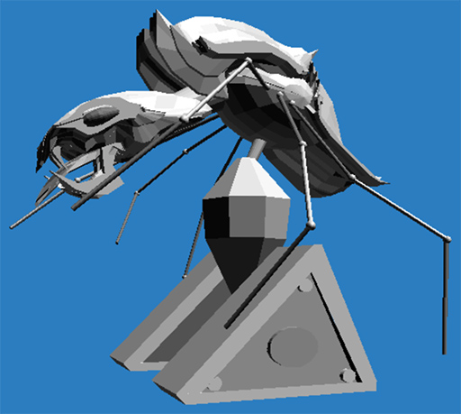

# DeSwivelizer

## References:
<ul>
	<li>https://www.macintoshrepository.org/1496-swivel-3d</li>
	<li>https://macintoshgarden.org/apps/swivel-3d</li>
	<li>https://www.interaction-design.org/literature/author/young-harvill</li>
	<li>https://www.evergreen.edu/magazine/2008spring/harvill</li>
	<li>https://en.wikipedia.org/wiki/VPL_Research</li>
	<li>https://en.wikipedia.org/wiki/Paracomp</li>
	<li>https://books.google.ca/books?id=_-8EewtpQEEC</li>
	<li>https://books.google.ca/books?id=lzsEAAAAMBAJ</li>
	<li>https://archive.org/stream/MacWorld_8901_January_1988/MacWorld_8901_January_1988_djvu.txt</li>
</ul>

